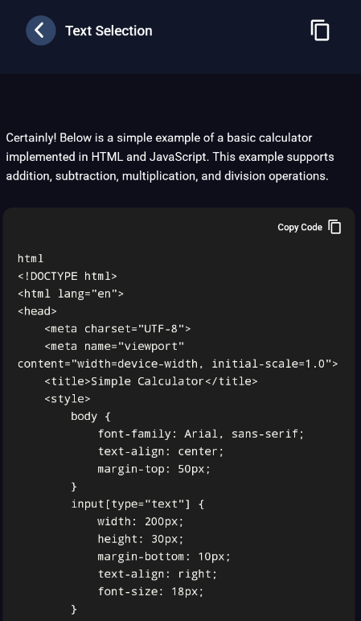

# 🦆 Duck Chat Bot – Mobile App (Expo & React Native)

Duck Chat Bot is a modern mobile application built with **Expo** and **React Native**, offering a fast and interactive chat experience with a smart AI assistant.  
The app features a smooth UI, responsive layout, dark mode–oriented theme colors, and high-performance rendering using FlashList and Reanimated.

---

## 📸 Screenshots

<div align="center">

<table>
  <tr>
    <td align="center">
      <h4>Home</h4>
      
    </td>
    <td align="center">
      <h4>History</h4>
      
    </td>
    <td align="center">
      <h4>Text Selection</h4>
      
    </td>
  </tr>
</table>

</div>


## 🚀 Features

- ✅ Built with **Expo Router** for structured file-based navigation  
- ✅ Global state management using **Redux Toolkit**  
- ✅ API communication, caching & realtime updates via **React Query**  
- ✅ High-performance lists powered by **FlashList**  
- ✅ Smooth animations using **Reanimated & Worklets**  
- ✅ Responsive UI using:  
  - `react-native-responsive-dimensions`  
  - `react-native-responsive-fontsize`  
- ✅ Modern UI components with **React Native Paper**  
- ✅ Clipboard support, splash screen, haptics, and safe-area handling  

---

## 🛠️ Tech Stack

### **Core**
- Expo 54  
- React Native 0.81  
- React 19  
- Expo Router 6  

### **State & Data**
- Redux Toolkit  
- React Query  
- Axios  

### **UI / UX**
- React Native Paper  
- Expo Image  
- SVG rendering  
- Indicators & loading animations  

### **Performance**
- FlashList  
- Reanimated  
- Worklets  

---

## 📦 Installation

### 1️⃣ Clone the repository
```sh
git clone https://github.com/your-username/duck-chat-bot-mobile-app.git
cd duck-chat-bot-mobile-app
